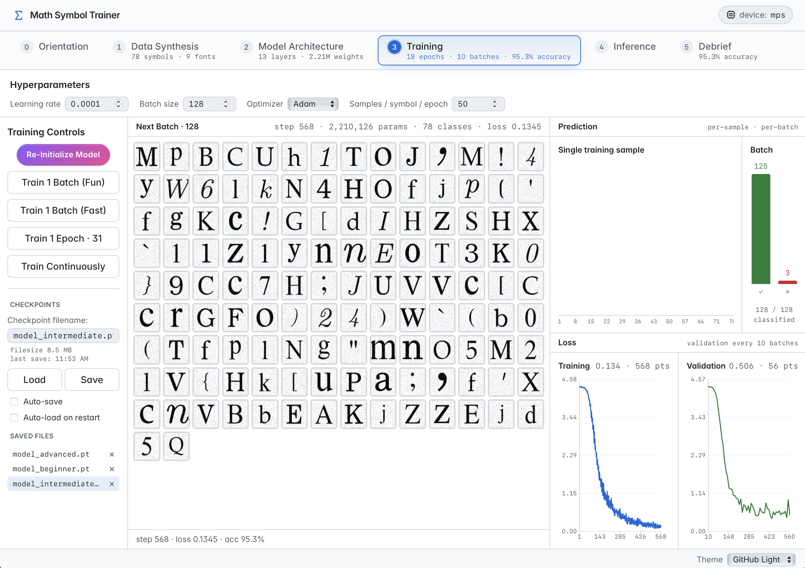
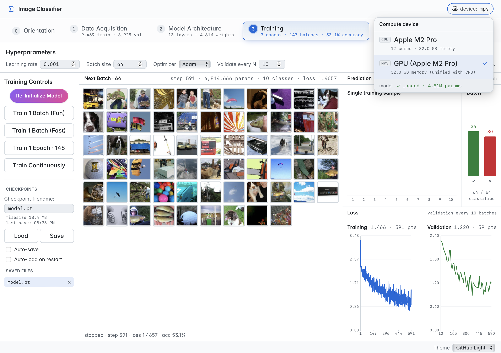
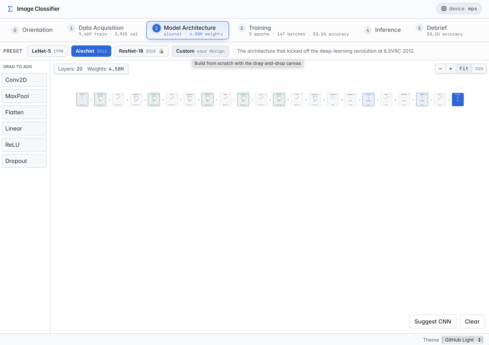

# ML Learning Apps

An experimental suite of small, self-contained applications for learning and visualizing concepts in machine learning. Each project trains a real neural network end-to-end and pairs the training loop with an interactive, accessible web UI.

The apps are still in development; I will be making improvements and adding new ML apps over time.

<p align="center">
  
  
  
</p>

## Apps

### `01-mnist-trainer/` — MNIST digit classifier

The starting point. Train a small MLP or CNN on MNIST while watching loss and validation curves update live. Features a draw-to-classify pad, a virtualized data explorer for browsing the training set, model checkpoint save/load, and a CLI (`train.py`) that mirrors the GUI.

### `02-math-symbols/` — Math symbol OCR

A printed-symbol classifier covering the glyphs used in mathematical writing — digits, alphanumerics, punctuation, Greek upper/lower, and math symbols (potentially several hundred classes). Distinct from MNIST in three ways:

- **Synthesized data, not downloaded.** Glyphs are rendered on the fly from system/open-source fonts during training. No fixed dataset on disk. Augmentation (noise, skew) is a live, tunable hyperparameter.
- **Held-out fonts for validation.** Generalization is measured against fonts the training pipeline never sees, so val accuracy reflects real generalization rather than memorization of font-class pairs.
- **Pedagogical tabbed UI** that walks through the full pipeline:
  - **Orientation** — overview and entry point.
  - **Data Synthesis** — pick symbol categories, training fonts, validation fonts, and augmentation; preview the synthesized images live.
  - **Model Architecture** — design a CNN layer-by-layer with drag-and-drop, or click *Suggest* for an architecture matched to the current data config.
  - **Training** — initialize the model, run single batches (with an animated per-image classification sweep), full epochs, or train continuously while watching training and validation loss curves stream in. Save / load checkpoints (including auto-save and auto-load on restart).
  - **Inference** — type free-form text with `$…$` math delimiters; KaTeX renders the preview, the model classifies each glyph, and the UI shows top-K predictions per cell with rendered alternatives and confidences.
  - **Debrief** — a contextual summary that describes the user's current pipeline state and tells them what to do next, with messages that adapt as training accuracy improves.

Checkpoints save the entire training pipeline (synthesis config + architecture + weights + loss histories) so you can suspend and resume across sessions without losing context.

### `03-image-classifier/` — Natural-image classifier (work in progress)

A photo-classification app built around three landmark CNN architectures from the history of deep learning. Trains on **Imagenette** — fast.ai's 10-class subset of ImageNet, the dataset AlexNet was trained on — which is small enough (~88 MB) to download in seconds and train at interactive speed on a single GPU, but realistic enough that the architectural choices visibly matter. Same six-tab pipeline as Math Symbols, with adaptations for natural images:

- **Data Acquisition** (replacing Data Synthesis) — one click downloads and extracts Imagenette into the project's `data/` folder, then shows per-class image counts and lets you toggle augmentations (random crop, horizontal flip, color jitter) that apply to the training pipeline only. A preview modal streams sample images through the actual train or val pipeline so you see exactly what the model will see.
- **Model Architecture** — three preset architectures span seventeen years of CNN history:
  - **LeNet-5** (1998) — LeCun et al.'s pre-AlexNet design, two conv→pool blocks plus a small dense head.
  - **AlexNet** (2012) — the architecture that kicked off the deep-learning revolution at ILSVRC, with five conv layers, three FC layers, ReLU, and dropout. Adapted for 96×96 input.
  - **ResNet-18** (2015) — He et al.'s residual network, locked as a torchvision module since residual connections don't fit the linear drag-and-drop layer model. Shows as a single placeholder block in the diagram.
  
  You can also pick *Custom* and design your own from the same drag-and-drop canvas Math Symbols uses.
- **Training** — same per-batch animation, single-epoch and continuous training loops, hot-swappable LR/optimizer, live training and validation loss charts, and full checkpoint save/load (with the dataset config, architecture, and loss histories all serialized alongside the weights).
- **Inference** — drag-and-drop an image (or click *Sample a val image* to pull a held-out one) and see the model's top-5 predictions with confidence bars; correct predictions on val images get a green check, incorrect get a red ✗.
- **Orientation** and **Debrief** mirror the Math Symbols equivalents, with copy adapted to image classification.

Status: the full pipeline is functional end-to-end (download → train → infer) and all three preset architectures train successfully. Treat it as a work in progress — copy and ergonomics are still being refined, and a CLI (`train.py`) for headless runs is not yet built.

### `04-agentic-symbols/` — Agentic Symbol Trainer

A reimagining of the Math Symbol Trainer where an embedded **ML Engineer agent** (Claude Opus 4.7, 1M context) can drive the same pipeline the user can — picking categories, designing architectures, training in bounded loops, evaluating against held-out fonts, and saving checkpoints. The agent's tool calls appear in a chat sidebar on the right, and the resulting state changes are mirrored live in the tabbed UI on the left, so you can watch a model get trained in real time.

Key ideas:

- **Two drivers, one pipeline.** The backend holds a single source-of-truth pipeline-state mirror; both the user (via UI controls) and the agent (via ~20 MCP tools) read and write it. Every mutation broadcasts over WebSocket, tagged with its origin, so the two stay in lockstep without fighting each other.
- **Live charts during agent training.** When the agent calls `train_n_batches`, every gradient step pushes a progress event over the WebSocket, so loss curves and the step counter update tick-by-tick on screen — you don't have to wait for the tool call to return.
- **Tool-restricted agent.** The agent can only call the MCP tools the app exposes (synthesis, architecture, training, eval, checkpoints, device); no shell, no filesystem access. Each `train_n_batches` call is capped at 200 batches so the agent gets natural decision points to check validation loss and narrate progress.
- **Resizable chat pane.** Drag the divider between the tab area and the chat to allocate horizontal space; the width persists across reloads.
- **Session resume.** Past chat sessions are persisted by the SDK and listed in a session menu, so you can come back to a long autonomous training run and pick up where it left off.

Status: end-to-end functional. The six-tab pipeline is forked from Math Symbols and the agent integration is the new piece. Architecturally a proof of concept for human-AI co-driving of an interactive ML training app.

## Stack

- **PyTorch** on Apple Silicon (MPS); CUDA / CPU paths are kept as fallbacks. Python 3.13.
- **uv** for Python dependency management — one shared virtual env at the repo root, since PyTorch is large and reinstalling per project is painful.
- **FastAPI** backends serving REST (plus a WebSocket for live training events in the MNIST app, and for state-mirror sync + agent training broadcasts in the Agentic Symbol Trainer).
- **Svelte 5 + Vite + Tailwind** frontends, served by FastAPI as static `dist/` in production and proxied through the Vite dev server in development.
- **Claude Agent SDK** (in the Agentic Symbol Trainer only) — an in-process MCP tool server exposes the same pipeline operations the UI drives, and `query()` runs the conversational turns.

## Quick start

Clone, install Python deps, run an app:

```bash
git clone https://github.com/danromik/machine-learning-apps.git
cd machine-learning-apps
uv sync                                    # creates .venv/ at repo root

# run an app — builds frontend, starts backend, opens browser
01-mnist-trainer/run.sh
# or
02-math-symbols/run.sh
# or
03-image-classifier/run.sh
# or
04-agentic-symbols/run.sh
```

All four apps default to `http://localhost:5041`. Only one can run at a time without overriding `MNIST_SERVER_PORT` / `MATH_SERVER_PORT` / `IMAGE_SERVER_PORT` / `AGENTIC_SERVER_PORT`.

For headless / scriptable training, the MNIST project also has a CLI:

```bash
uv run python 01-mnist-trainer/train.py --model cnn --epochs 5
```

## Repo layout

```
.
├── pyproject.toml                # shared Python deps
├── 01-mnist-trainer/             # MLP / CNN trained on MNIST
├── 02-math-symbols/              # OCR over synthesized glyphs
├── 03-image-classifier/          # natural-image classifier on Imagenette (WIP)
├── 04-agentic-symbols/           # Math Symbols pipeline + embedded ML Engineer agent
└── NN-<next-project>/            # future projects, numbered in curriculum order
```

Each project is fully self-contained — its own `data/`, `checkpoints/`, models, training loop. Projects can be deleted, copied, or forked without affecting siblings.

## License

[MIT](LICENSE).
